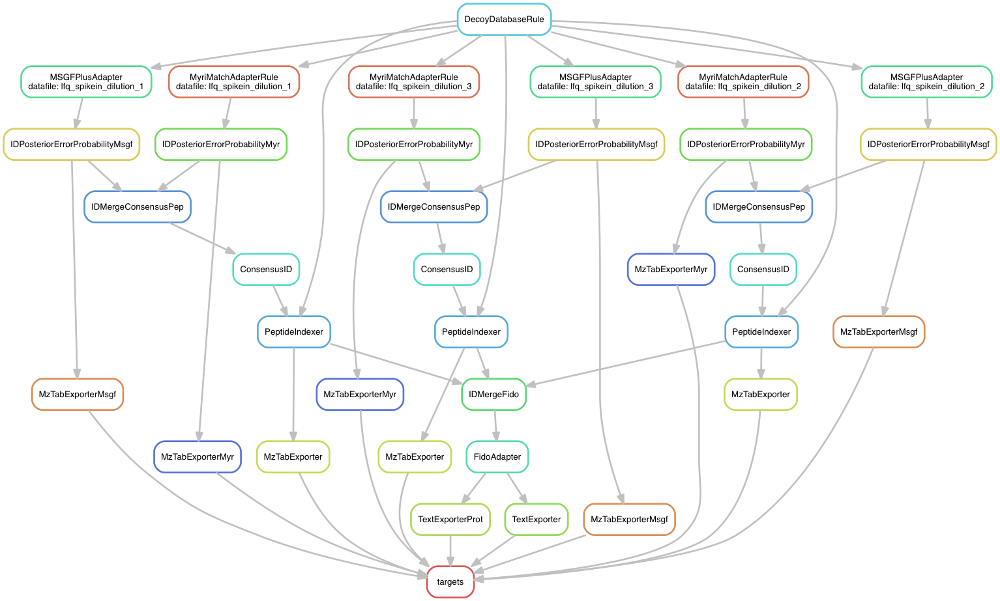

# regius
*Snakemake, OpenMS, and more*

The current code requires python 3.6 and snakemake

## Quick Setup
### Setup Snakemake:

A) via conda
```
conda config --add channels conda-forge
conda config --add channels bioconda
conda install snakemake

```
(for conda, it is preferred to add the conda-forge and bioconda channels)

or B) via pip:

```
pip install snakemake
```

### Setup msconvert VM
*This step is only required if conversion of instrument files is needed.  This step can be omitted if all raw files are in the mzML format.  A licensed version of MS Windows is required for creation of the VM.*

Install VirtualBox and create the VM for file conversion. The workflow uses a windows 7 (also works with windows 10) virtual machine to convert instrument files to mzML. The VM contains ProtwoWizard msconvert.exe. A python script is invoked by the workflow to convert the files using the VBoxManage api.

1) Download VirtualBox here:
[https://www.virtualbox.org/wiki/Downloads](https://www.virtualbox.org/wiki/Downloads)

2) Install Windows 7/10

Download and Install ProteoWizard binaries for Windows.
[http://proteowizard.sourceforge.net/](http://proteowizard.sourceforge.net/)

3) create the directory "c:\work" in the VM.  This folder is where temp files will be copied and converted.  The VM cleans up this folder.  (TODO add cleanup of orphaned files)

4) update the python scripts to point to the ProteoWizard directory that contains msconvert.exe

### Setup OpenMS Docker Image
Create the docker container for OpenMS and thrid-party tools.

```
cd docker_openms_2.2.0
docker build -t mfreitas/openms:2.2.0
```
NOTE:  if you use a different tag, you will need to change the tagged container name in the Snakefile.


### Create workflow directories
Create directories that are needed for the workflow to run:
```
mkdir work
mkdir dbsearch
mkdir results
```

The folder hierarch should look like this:
```
Snakefile <- workflow description
cfg.py <- configuration options for tools
raw/ <- Location of instrument files
fasta/ <- Location of protein database files
dbsearch/ <- where search idXML files will be created
work/ <- where all tmp files will be created
results/ <- were final results will be created
vbox_msconvert/ <- location of msconvert VM scripts
docker_openms_2.2.0/ <- Location of Dockerfile for OpenMS container
```

### Run the example workflow
The example workflow performs consensus analysis of MyriMatch and MSGF+ database search.

A DAG representation of the example workflow is shown below.



To perform a dry run:

```
snakemake -n
```

To run the workflow:
```
snakemake
```
